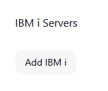
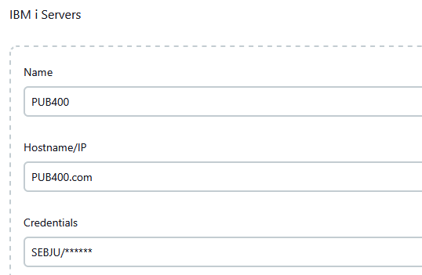

# IBM i Pipeline Steps


Jenkins plugin providing IBM i pipeline steps such as command execution, Db2 queries execution, Save Files transfer and
IFS transfers.

----

- [Configuration](#configuration)
- [Steps](#steps)
  - [onIBMi](#onibmi)
  - [ibmiCommand](#ibmicommand)
  - [ibmiRunSQL](#ibmirunsql)
  - [ibmiGetSAVF](#ibmigetsavf)
  - [ibmiPutSAVF](#ibmiputsavf)
  - [ibmiGetIFS](#ibmigetifs)
  - [ibmiPutIFS](#ibmiputifs)
  - [ibmiGetSPLF](#ibmigetsplf)
  - [ibmiWaitJob](#ibmiwaitjob)
- [Enumerations](#enumerations)
  - [OnMSGW](#onmsgw)
- [Returned objects](#returned-objects)
  - [CallResult](#callresult)
  - [IBMiJob](#ibmijob)
  - [SQLResult](#sqlresult)
  - [SQLColumn](#sqlcolumn)
  - [SQLRow](#sqlrow)
  - [SaveFileContent](#savefilecontent)
  - [SAVFEntry](#savfentry)
  - [SpooledFiles](#spooledfiles)
  - [SpooledFile](#spooledfile)
- [Examples](#examples)
  - [Save a library, download the Save File and archive its content description](#save-a-library-download-the-save-file-and-archive-its-content-description)
  - [Transfer a libray from one LPAR to another](#transfer-a-libray-from-one-lpar-to-another)
  - [Submit a job and download the spooled files it generated](#submit-a-job-and-download-the-spooled-files-it-generated)

## Configuration

One or more IBM i servers need to be declared in Jenkins System settings before the IBM i steps can be used.

1. Open the System settings: `Manage Jenkins -> System`
2. Scroll down to the `IBM i Servers` section and click `Add IBM i`
3. Fill in the `Name` and `Hostname/IP` fields, then select the `Credentials` to use to connect to the server. Click on
   the `+ Add` button to add new credentials.
4. Click on `Advanced` to show optional fields to force a CCSID and enable secure connection




## Steps

### onIBMi

Every IBM i step below must be run inside an `onIBMi` step block. This step opens the connection to the IBM i server and
makes it available to the other IBM i steps. Once the end of the onIBMi block is reached, the connection is closed,
related resources are freed and the `IBMI_` environment variables are removed.

#### IBMI_ environment variables

This steps loads the following environment variables during its execution. These variables are accessible through the
`env` object (e.g. `env.IBMI_PROFILE`).
| Name             | Description                                                |
|:-----------------|:-----------------------------------------------------------|
| IBMI_HOST        | The connected IBM i hostname                               |
| IBMI_PROFILE     | The user profile used to connect to the IBM i              |
| IBMI_CCSID       | The current CCSID                                          |
| IBMI_COMMAND_JOB | The IBM i command job identifier (i.e. `number/user/name`) |
| IBMI_VERSION     | The OS version of the IBM i (i.e. `version.release`)       |

#### Parameters

| Name         | Required | Type      | Description                                                                                   |
|:-------------|:---------|:----------|:----------------------------------------------------------------------------------------------|
| name         | ☑        | `String`  | The name of an IBM i server, as defined in the System settings.                               |
| iasp         | ✖        | `String`  | The name of an iASP that will be set for this connection (in both command and database jobs). |
| traceEnabled | ✖        | `boolean` | When `true`, more logs will be printed during IBM i steps execution; defaults to `false`.     |

#### Example

```groovy
onIBMi('PUB400') {
    print "Command job is ${env.IBMI_COMMAND_JOB}"
    print "Current CCSID is ${env.IBMI_PROFILE}"

    //Some pipeline steps running on PUB400
    ibmiCommand "SNDMSG MSG('Hello from Jenkins') TOUSR(ESPENGLER)"
}

onIBMi(server: 'DEVSERVER', iasp: "IASP1") {
    //Some pipeline steps running on DEVSERVER with iASP IASP1 enabled    
    ibmiCommand "CRTLIB LIB(IASPLIB) ASPDEV(IASP1)"
}

onIBMi(server: 'PUB400', traceEnabled: true) {
    //Some pipeline steps running on PUB400 with more logs
    ibmiCommand "SNDMSG MSG('Hello from Jenkins again') TOUSR(PVENKMAN)"
}
```

### ibmiCommand

Runs a CL command and returns a `CallResult` object.

#### Parameters

| Name        | Required | Type      | Description           |
|:------------|:---------|:----------|:----------------------|
| command     | ☑        | `String`  | The CL command to run |
| failOnError | ✖        | `boolean` | v                     |

#### Returned value

A [`CallResult`](#callresult) object.

#### Example

```groovy
//Create a library
def library = 'COOLSTUFF'
ibmiCommand "CRTLIB LIB($library)"

//Create a library and carry on only if it exists
def result = ibmiCommand(command: "CRTLIB LIB($library)", failOnError: false)
if (!result.successful) {
    if (result.getMessage('CPF2111') != null) {
        echo "Library $library already exists"
    } else {
        //Any other error is reported and stops the pipeline
        error result.getPrettyMessages()
    }
}

//Delete a library; carry on whatever happens
ibmiCommand(command: "DLTLIB LIB($library)", failOnError: false)

```

### ibmiRunSQL

Executes a Db2 for i SQL query and returns an `SQLResult` object.

#### Parameters

| Name | Required | Type     | Description          |
|:-----|:---------|:---------|:---------------------|
| sql  | ☑        | `string` | The SQL query to run |

#### Returned value

An [`SQLResult`](#sqlresult) object.

#### Example

```groovy
//List all listening ports
def result = ibmiRunSQL "SELECT * from QSYS2.netstat_info where local_address = '0.0.0.0'"
print "Query returned ${result.rowCount} row(s)"

//Print well-known ports
result.rows.each { row ->
    def portName = row.get("LOCAL_PORT_NAME")
    if (portName != null) {
        print "${row.getString("LOCAL_PORT")} ($portName)"
    }
}

//Run a delete query
ibmiRunSQL "Call QSYS2.QCMDEXC('DSPOBJD OBJ(QGPL/*ALL) OBJTYPE(*ALL) DETAIL(*FULL) OUTPUT(*OUTFILE) OUTFILE(QTEMP/OBJECTS)')"
def delete = ibmiRunSQL "Delete from QTEMP/OBJECTS"
print "Query deleted ${delete.updateCount} row(s)"
```

### ibmiGetSAVF

Downloads a Save File by copying it to a temporary stream file on the IFS and downloading it.
The temporary stream file is deleted once the step is done.
The step returns the description of the Save File as well as its content.

#### Parameters

| Name    | Required | Type     | Description                                          |
|:--------|:---------|:---------|:-----------------------------------------------------|
| library | ☑        | `String` | The Save File library.                               |
| name    | ☑        | `String` | The Save File name.                                  |
| toFile  | ☑        | `String` | A local path where the Save File will be downloaded. |

#### Returned value

A [`SaveFileContent`](#savefilecontent) object.

#### Example

```groovy
def savfContent = ibmiGetSAVF(libray: "QTEMP", name: "BACKUP", toFile: "backup.savf")
print "${savfContent.entries.size} object(s) saved"
//Print each saved object
savfContent.entries.each { entry -> print "  - ${entry.name} (${entry.type})" }
```

### ibmiPutSAVF

Uploads a local file on the IFS and restore the Save File as an Object in a `library` with the given `name`. The local
file must be a stream file of a Save File.
The uploaded stream file is deleted once the step is done.
The step returns the description of the Save File as well as its content.

#### Parameters

| Name     | Required | Type     | Description                                              |
|:---------|:---------|:---------|:---------------------------------------------------------|
| fromFile | ☑        | `String` | The local path of the Save File's stream file to upload. |
| library  | ☑        | `String` | The Save File library.                                   |
| name     | ☑        | `String` | The Save File name.                                      |

#### Returned value

A [`SaveFileContent`](#savefilecontent) object.

#### Example

```groovy
def backupContent = ibmiPutSAVF(fromFile: "backup.savf", library: "QTEMP", name: "BACKUP")
imbiCommand "RSTLIB SAVLIB(${backupContent.savedLibrary}) DEV(*SAVF) SAVF(QTEMP/BACKUP)"
```

### ibmiGetIFS

Downloads a remote IFS file or folder and puts it in a local folder. The local folder is created if needed.

#### Parameters

| Name | Required | Type     | Description                                                                  |
|:-----|:---------|:---------|:-----------------------------------------------------------------------------|
| from | ☑        | `String` | The remote IFS path of the folder or file to download.                       |
| to   | ☑        | `String` | The local path of the folder where the `from` IFS target will be downloaded. |

#### Returned value

None

#### Example

```groovy
//Copy an IFS folder to the local workspace root
ibmiGetIFS(from: "/home/rstanz/library", to: ".")

//Copy an IFS file to the local folder named "download"
ibmiGetIFS(from: "/home/wzeddemore/paycheck.txt", to: "download")
```

### ibmiPutIFS

Uploads a local file or folder and puts it in a remote IFS folder. The remote IFS folder is created if needed.

#### Parameters

| Name | Required | Type     | Description                                                                     |
|:-----|:---------|:---------|:--------------------------------------------------------------------------------|
| from | ☑        | `String` | The local path of the folder or file to upload.                                 |
| to   | ☑        | `String` | The remote IFS path of the folder where the `from` IFS target will be uploaded. |

#### Returned value

None

#### Example

```groovy
//Put a single local file into the remote /tmp/toBeDeleted IFS folder
ibmiPutIFS(from: "jail/slimer.png", to: "/tmp/toBeDeleted")

//Put a local folder into the /home/pvenkman folder (resulting path is /home/pvenkman/tests
ibmiPutIFS(from: "tests", to: "/home/pvenkman")
```

### ibmiGetSPLF

Downloads spooled files from a Job into a local folder and returns the spooled files list.

#### Parameters

| Name      | Required | Type      | Description                                                                                       |
|:----------|:---------|:----------|:--------------------------------------------------------------------------------------------------|
| jobName   | ☑        | `String`  | The Job name.                                                                                     |
| jobNumber | ☑        | `String`  | The Job number.                                                                                   |
| jobUser   | ☑        | `String`  | The The Job user.                                                                                 |
| to        | ☑        | `String`  | The local path of the folder where the spooled files will be be downloaded.                       |
| clearTo   | ✖        | `boolean` | If `true`, the local folder is cleared before downloading the spooled files; defaults to `false`. |

#### Returned value

A [`SpooledFiles`](#spooledfiles) object.

#### Example

```groovy
//Put all spooled files from a job into the local splfs folder
def spooledFiles = ibmiGetSPLF(jobName: "SPMM", jobNumber: "50484", jobUser: "GOZER", to: "splfs")
//Print information about the downloaded spooled files
print "${spooledFiles.size} spooled file(s) downloaded"
spooledFiles.each { splf -> print "${splf.name} (${splf.number})" }
```

### ibmiWaitJob

Wait for a Job to end and blocks the pipeline execution.

#### Parameters

| Name    | Required | Type                | Description                                                                                                                      |
|:--------|:---------|:--------------------|:---------------------------------------------------------------------------------------------------------------------------------|
| name    | ☑        | `String`            | The Job name.                                                                                                                    |
| number  | ☑        | `String`            | The Job number.                                                                                                                  |
| user    | ☑        | `String`            | The Job user.                                                                                                                    |
| timeout | ✖        | `int`               | A timeout in seconds after which the pipeline execution will carry on even of the Job has not ended.                             |
| onMSGW  | ✖        | [`OnMSGW`](#onmsgw) | The action to take when the Job hits the MSGW status. Possible values are: `WAIT`, `FAIL`, `KILL`, `RESUME`; defaults to `WAIT`. |

#### Returned value

A [`Job`](https://javadoc.io/doc/net.sf.jt400/jt400/latest/com/ibm/as400/access/package-summary.html) object.

#### Example

```groovy
def result = ibmiCommand "SBMJOB CMD(COMPILE...)"
if(result.successful) {
    def job = result.getSubmittedJobs().getAt(0)
    if(job){
        //Wait for the job and fail pipeline if it hits MSGW status
        ibmiWaitJob name: job.name, number: job.number, user: job.user, onMSGW: 'FAIL'
    }
}
```

## Enumerations

### OnMSGW
| Value  | Description                                          |
|:-------|:-----------------------------------------------------|
| FAIL   | Stop the pipeline execution and marks it as failed.  |
| KILL   | Kill the Job and resume pipeline execution.          |
| RESUME | Leave the Job in MSGW and resume pipeline execution. |
| WAIT   | Wait for the Job to be killed or resumed.            |

## Returned objects

### CallResult

| Methods                        | Return type                                                                                                                                                                      | Description                                                                                                                                                                                                                                                            |
|:-------------------------------|:---------------------------------------------------------------------------------------------------------------------------------------------------------------------------------|:-----------------------------------------------------------------------------------------------------------------------------------------------------------------------------------------------------------------------------------------------------------------------|
| getMessages()                  | [`List`](https://docs.oracle.com/javase/8/docs/api/java/util/List.html)<[AS400Message](https://javadoc.io/doc/net.sf.jt400/jt400/latest/com/ibm/as400/access/AS400Message.html)> | Returns the list of [AS400Message](https://javadoc.io/doc/net.sf.jt400/jt400/latest/com/ibm/as400/access/AS400Message.html) generated during the command execution.                                                                                                    |
| getMessage(`String` messageId) | [AS400Message](https://javadoc.io/doc/net.sf.jt400/jt400/latest/com/ibm/as400/access/AS400Message.html)                                                                          | Look for the first [AS400Message](https://javadoc.io/doc/net.sf.jt400/jt400/latest/com/ibm/as400/access/AS400Message.html) whose ID is `messageId` and returns it. Returns `null` if not found.                                                                        |
| getLastMessage()               | [AS400Message](https://javadoc.io/doc/net.sf.jt400/jt400/latest/com/ibm/as400/access/AS400Message.html)                                                                          | Returns the last [AS400Message](https://javadoc.io/doc/net.sf.jt400/jt400/latest/com/ibm/as400/access/AS400Message.html) generated by the command or `null` if there is no message.                                                                                    |
| getPrettyMessages()            | `String`                                                                                                                                                                         | Returns a `String` resulting from the concatenation of every [AS400Message](https://javadoc.io/doc/net.sf.jt400/jt400/latest/com/ibm/as400/access/AS400Message.html) returned by the command, one per line, formatted using this pattern: `[{id}][{severity}] {text}`. |
| isSuccessful()                 | `boolean`                                                                                                                                                                        | Returns `true ` if the command execution was successful, `false` otherwise.                                                                                                                                                                                            |
| getSubmittedJobs()             | [`List`](https://docs.oracle.com/javase/8/docs/api/java/util/List.html)<[IBMiJob](#ibmijob)>                                                                                     | Returns a list of [IBMiJob](#ibmijob) found by browsing the `CPC1221` messages from the call result.                                                                                                                                                                   |

### IBMiJob

| Methods     | Return type | Description       |
|:------------|:------------|:------------------|
| getName()   | `String`    | The job's name.   |
| getUser()   | `String`    | The job's user.   |
| getNumber() | `String`    | The job's number. |

### SQLResult

| Methods          | Return type                                                                                        | Description                                                                                                            |
|:-----------------|:---------------------------------------------------------------------------------------------------|:-----------------------------------------------------------------------------------------------------------------------|
| getColumns()     | [`List`](https://docs.oracle.com/javase/8/docs/api/java/util/List.html)<[`SQLColumn`](#sqlcolumn)> | *Select statements only* : the definition of each columns returned by the query.                                       |
| getColumnCount() | `int`                                                                                              | *Select statements only* : the number of columns returned by the query.                                                |
| getRows()        | [`List`](https://docs.oracle.com/javase/8/docs/api/java/util/List.html)<[`SQLRow`](#sqlrow)>       | *Select statements only* : the rows returned by the query.                                                             |
| getRowCount()    | `int`                                                                                              | *Select statements only* : the number of rows returned by the query.                                                   |
| getUpdateCount() | `int`                                                                                              | *Insert/Update/Delete statements only* : the number of rows affected by the query.                                     |
| toJSON()         | `String`                                                                                           | *Select statements only* : a JSON representation of the rows.                                                          |
| toCSV()          | `String`                                                                                           | *Select statements only* : a CSV representation of the rows. First line is the header, then one line per rows returned |

### SQLColumn

| Methods       | Return type | Description                                                                                                         |
|:--------------|:------------|:--------------------------------------------------------------------------------------------------------------------|
| getName()     | `String`    | The column's name.                                                                                                  |
| getTypeName() | `String`    | The columns's database-specific type. name.                                                                         |
| getSize()     | `int`       | The column's size.                                                                                                  |
| getScale()    | `int`       | The number of digits to right of the decimal point. 0 is returned for data types where the scale is not applicable. |

### SQLRow

| Methods                            | Return type                                                                              | Description                                                                                                                                                   |
|:-----------------------------------|:-----------------------------------------------------------------------------------------|:--------------------------------------------------------------------------------------------------------------------------------------------------------------|
| getCells()                         | [`Map`](https://docs.oracle.com/javase/8/docs/api/java/util/Map.html)<`String`,`Object`> | A [`Map`](https://docs.oracle.com/javase/8/docs/api/java/util/Map.html) whose key is the column name and the value is the column's value.                     |
| get(`String` columnName)           | `Object`                                                                                 | Returns the value of the given `columnName`.                                                                                                                  |
| getString(`String` columnName)     | `String`                                                                                 | Returns the `String` value of the given `columnName`.                                                                                                         |
| getInt(`String` columnName)        | `int`                                                                                    | Returns the `int` value of the given `columnName`.                                                                                                            |
| getDouble(`String` columnName)     | `double`                                                                                 | Returns the `double` value of the given `columnName`.                                                                                                         |
| getFloat(`String` columnName)      | `float`                                                                                  | Returns the `float` value of the given `columnName`.                                                                                                          |
| getShort(`String` columnName)      | `short`                                                                                  | Returns the `short` value of the given `columnName`.                                                                                                          |
| getBigDecimal(`String` columnName) | [BigDecimal](https://docs.oracle.com/javase/8/docs/api/java/math/BigDecimal.html)        | Returns the [BigDecimal](https://docs.oracle.com/javase/8/docs/api/java/math/BigDecimal.html) value of the given `columnName` or `null` if it cannot be cast. |
| getDate(`String` columnName)       | [Date](https://docs.oracle.com/javase/8/docs/api/java/sql/Date.html)                     | Returns the [Date](https://docs.oracle.com/javase/8/docs/api/java/sql/Date.html) value of the given `columnName` or `null` if it cannot be cast.              |
| getTime(`String` columnName)       | [Time](https://docs.oracle.com/javase/8/docs/api/java/sql/Time.html)                     | Returns the [Time](https://docs.oracle.com/javase/8/docs/api/java/sql/Time.html) value of the given `columnName` or `null` if it cannot be cast.              |
| getTimeStamp(`String` columnName)  | [Timestamp](https://docs.oracle.com/javase/8/docs/api/java/sql/Timestamp.html)           | Returns the [Timestamp](https://docs.oracle.com/javase/8/docs/api/java/sql/Timestamp.html) value of the given `columnName` or `null` if it cannot be cast.    |

### SaveFileContent

| Methods            | Return type                                                                                        | Description                                                                                                             |
|:-------------------|:---------------------------------------------------------------------------------------------------|:------------------------------------------------------------------------------------------------------------------------|
| getName()          | `String`                                                                                           | The Save File name.                                                                                                     |
| getCreationLPAR()  | `String`                                                                                           | The name of the IBM i on which the Save File was created.                                                               |
| getSavedLibrary()  | `String`                                                                                           | The library saved in the Save File.                                                                                     |
| getDescription()   | `String`                                                                                           | The Save File description.                                                                                              |
| getTargetRelease() | `String`                                                                                           | The SAVxxx command's `TGTRLS` parameter; If `*CURRENT` or `*PREV` was used, this will return the actual `VxRyMz` value. |
| getSize()          | `long`                                                                                             | The Save File size in bytes.                                                                                            |
| getEntries()       | [`List`](https://docs.oracle.com/javase/8/docs/api/java/util/List.html)<[`SAVFEntry`](#savfentry)> | The list of objects saved in the Save File.                                                                             |
| toJSON()           | `String`                                                                                           | The JSON representation of the SAve File metadata and its content.                                                      |

### SAVFEntry

| Methods                      | Return type | Description                                                           |
|:-----------------------------|:------------|:----------------------------------------------------------------------|
| getName()                    | `String`    | The name of the saved Object.                                         |
| getDescription()             | `String`    | The description of the saved Object.                                  |
| getExtendedObjectAttribute() | `String`    | The extended information about the object type.                       |
| getLibrary()                 | `String`    | The library from which the object was saved.                          |
| getOwner()                   | `String`    | The object owner's user profile.                                      |
| getSize()                    | `long`      | The total size of the Object in bytes.                                |
| getType()                    | `String`    | The type of the object.                                               |
| isDataSaved()                | `boolean`   | Indicates whether the data for this object was saved with the object. |

### SpooledFiles

All the methods from [`List`](https://docs.oracle.com/javase/8/docs/api/java/util/List.html)<[
`SpooledFile`](#spooledfile)> and the methods below.

| Methods  | Return type | Description                                                                |
|:---------|:------------|:---------------------------------------------------------------------------|
| toJSON() | `String`    | The JSON representation of each [`SpooledFile`](#spooledfile) in the list. |

### SpooledFile

| Methods        | Return type | Description                                       |
|:---------------|:------------|:--------------------------------------------------|
| getName()      | `String`    | The name of the spooled file.                     |
| getNumber()    | `int`       | The number of the spooled file.                   |
| getSize()      | `long`      | The spooled file size in bytes.                   |
| getJobName()   | `String`    | The name of the job that owns the spooled file.   |
| getJobNumber() | `String`    | The number of the job that owns the spooled file. |
| getJobUser()   | `String`    | The user of the job that owns the spooled file.   |
| getUserData()  | `String`    | The user-specified data that describes the file.  |
| getFileName()  | `String`    | The local file name of the spooled file.          |

## Examples

### Save a library, download the Save File and archive its content description

```groovy
node {
    stage('IBMi') {
        onIBMi(server: 'PUB400', traceEnabled: true) {
            ibmiCommand "CRTSAVF QTEMP/MYSAVEFILE"
            ibmiCommand "SAVLIB LIB(COOLSTUFF) DEV(*SAVF) SAVF(QTEMP/MYSAVEFILE)"

            def saveFileContent = ibmiGetSAVF library: "QTEMP", name: "MYSAVEFILE", toFile: "COOLSTUFF.savf"
            writeFile encoding: "UTF-8", file: "output/downloadSAVF.json", text: saveFileContent.toJSON()
            archiveArtifacts artifacts: "output/*.json"
        }
    }
}
```

### Transfer a libray from one LPAR to another

```groovy
node {
    stage('Save') {
        onIBMi(server: 'IBMI_1', traceEnabled: true) {
            ibmiCommand "CRTSAVF QTEMP/BACKUP"
            ibmiCommand "SAVLIB LIB(ECTO1) DEV(*SAVF) SAVF(QTEMP/BACKUP)"
            ibmiGetSAVF library: "QTEMP", name: "BACKUP", toFile: "ecto1.savf"
        }
    }

    stage('Restore') {
        onIBMi(server: 'IBMI_2', traceEnabled: true) {
            def content = ibmiPutSAVF(fromFile: "ecto1.savf", library: "QTEMP", name: "BACKUP")
            ibmiCommand "RSTLIB SAVLIB(${content.savedLibrary}) DEV(*SAVF) SAVF(QTEMP/BACKUP)"
        }
    }
}
```

### Submit a job and download the spooled files it generated

```groovy
node {
    stage('Compile') {
        //Submit DSPOBJD to produce a spooled file with QGPL's objects information
        def result = ibmiCommand 'SBMJOB CMD(DSPOBJD OBJ(QGPL/*ALL) OBJTYPE(*ALL) OUTPUT(*PRINT)) JOB(DETAILS)'

        //Get the submitted job information (there can be only one)
        def job = result.getSubmittedJobs().getAt(0)

        //Wait for the job to end
        ibmiWaitJob name: job.name, number: job.number, user: job.user

        //Download the job's spooled files
        ibmiGetSPLF jobName: job.name, jobNumber: job.number, jobUser: job.user, to: 'objects'
    }
}
```